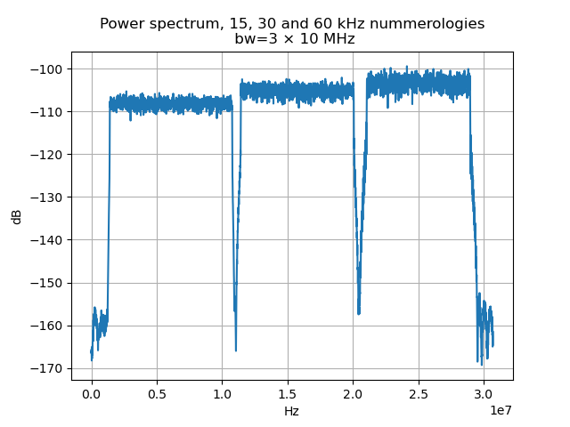
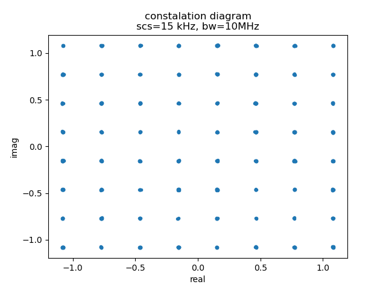
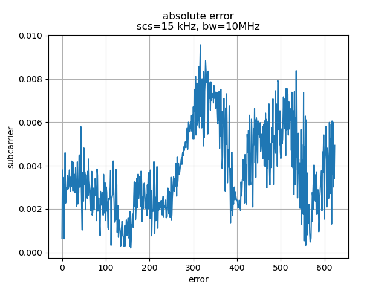
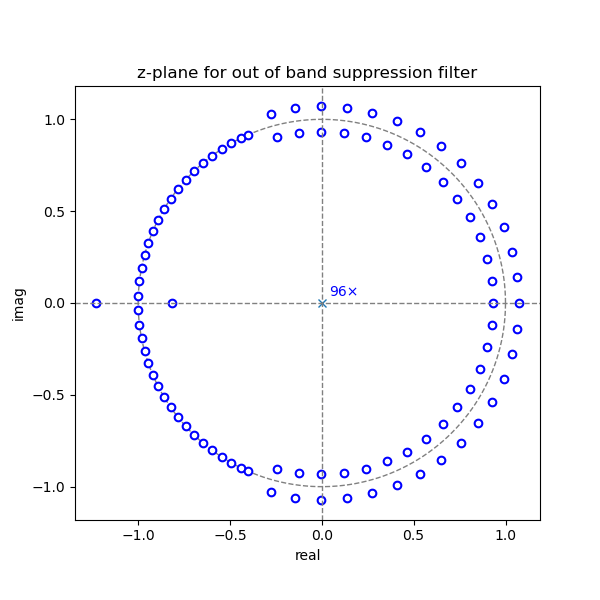
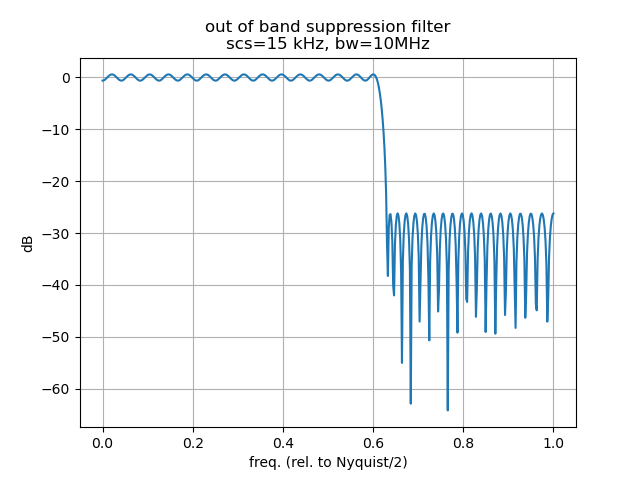
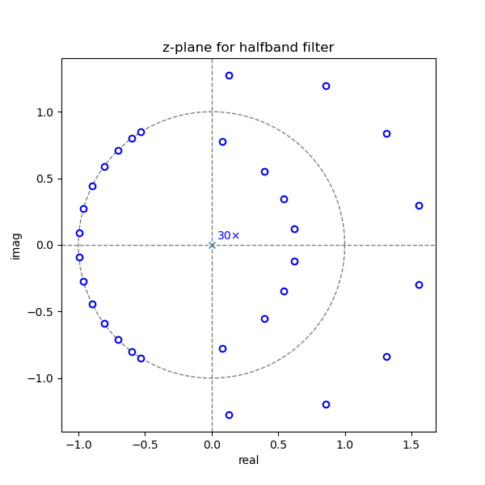
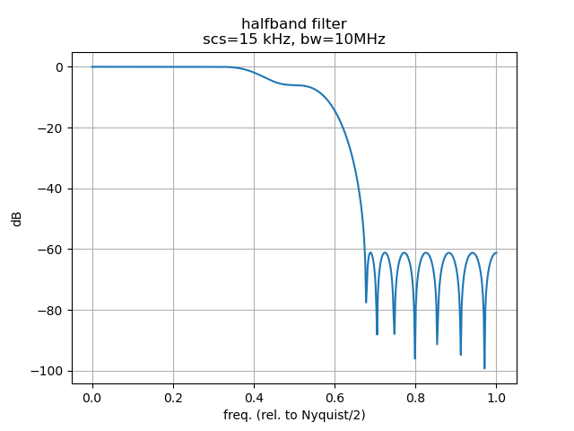

This repository contains a subsystem-level model addressing a central challenge in [5G](https://en.wikipedia.org/wiki/5G) systems: how to schedule and process [mixed numerologies](https://www.rfwireless-world.com/articles/5g/5g-nr-numerology-terminology).

While 4G was primarily designed to **connect people**, 5G expands that vision to **connect everything**—from autonomous vehicles navigating busy roads to battery-powered water meters in deep basements. These devices have vastly different physical characteristics and communication needs. High-mobility use cases require low-latency and high-reliability links, whereas low-power sensors may only need to transmit a few bits infrequently. Supporting such diverse requirements calls for a more flexible physical layer.

To achieve this, 5G introduces the concept of **multiple [numerologies](https://en.wikipedia.org/wiki/Numerology_(wireless))**—sets of OFDM parameters (like subcarrier spacing, symbol duration, and cyclic prefix) that can coexist within the same system. However, enabling multiple numerologies side by side introduces a non-trivial challenge: **Inter-Numerology Interference (INI)**.

### Inter-Numerology Interference (INI)

Each numerology in 5G defines its own subcarrier spacing and OFDM symbol duration. Since OFDM relies on the assumption that each subcarrier is periodic over the symbol duration, this assumption breaks down when one numerology is observed or processed using the timing parameters of another. The result is that subcarriers are no longer sampled over integer multiples of their period, leading to **discontinuities** in the time domain and **spectral leakage** in the frequency domain.

This leakage violates subcarrier orthogonality and causes **Inter-Numerology Interference (INI)**. Notably, INI can occur even when numerologies are separated in time or frequency, because the interference stems from **mismatched symbol structures**, not just physical overlap.

To address this, the model presented in this repository applies a structured filtering and mixing approach:

* Each symbol stream is **low-pass filtered at the base rate corresponding to its numerology**, ensuring that its spectral content remains confined to its designated band.
* The filtered signals are then **interpolated and mixed** into a shared frequency-domain representation, preserving both time and frequency isolation between numerologies.

This approach contains spectral leakage and enables clean, modular symbol processing, while maintaining flexibility in resource scheduling.

Although not implemented in this model, **windowing techniques**—which taper symbol edges to reduce sidelobes—are another known strategy for mitigating INI. These can complement filtering approaches and, in more advanced systems, may be used in combination to further suppress interference.

The focus of this model is on **feasibility and modular design**, supporting architectural exploration of numerology coexistence with an emphasis on clarity, flexibility, and system-level insight.

### Concept of the Solution

This solution addresses **Inter-Numerology Interference (INI)** through a modular and scalable signal processing pipeline. Each numerology is handled independently in early stages, then progressively integrated in later stages through controlled interpolation and frequency-domain mixing. The key advantage of this design is that **INI is mitigated early**—before numerologies are combined—allowing for clean coexistence and efficient processing.

The core stages are:

1. **Static, Per-Numerology Processing (Before Interpolation and Mixing)**
   Each numerology is first processed **independently at its native (low) sample rate**, determined by its subcarrier spacing and symbol duration. In this stage:

   * A dedicated **low-pass filter** is applied to isolate the signal’s spectrum and suppress out-of-band (OOB) emissions.
   * Additional processing includes FFT bin mapping, frequency alignment, cyclic prefix insertion, and optional subcarrier shifts for filter symmetry.
   * All processing is confined to the **narrow bandwidth actually used** by the symbol—avoiding wasteful computation across unused spectrum.

   🔹 **This targeted, low-rate processing significantly reduces computational load** compared to systems that operate over the entire wideband signal, especially when many numerologies occupy sparse or narrow bands.

2. **Dynamic, Stage-Wise Mixing and Interpolation**
   After static processing, each signal is **interpolated to a higher sample rate**, enabling compatibility with other numerologies. At each interpolation stage:

   * Signals are examined for spectral adjacency and time overlap.
   * If compatible, they are **merged into a single composite stream** with correct relative positioning in frequency.
   * If not, they remain separate and move to the next stage.

   This staged strategy ensures that mixing only occurs when safe and efficient, avoiding unnecessary interference or complexity.

3. **Final Baseband Integration at Output Sample Rate**
   At the final stage—all signals are **fully interpolated and merged** into a unified baseband stream. Earlier filtering and frequency planning ensure their bands do not overlap, so the merging is deterministic and clean.

   The output is a **composite baseband signal**, suitable for transmission or further system-level processing, and free from INI due to the modular design and up-front filtering.
   
### Static Processing Chain

Symbols are processed individually, following the structure defined in the [ETSI 5G NR specification (TS 138 211)](https://www.etsi.org/deliver/etsi_ts/138200_138299/138211/15.03.00_60/ts_138211v150300p.pdf). Each symbol is fully described by:

- **Timing parameters**: `frame`, `subframe`, `slot`, and `symbol index`
- **Frequency resources**: `freqOffset`, `numPrbs` (-and `startPrbc`) allocation  
- **Numerology**: subcarrier spacing and cyclic prefix, as determined by the frame structure
    
This standardized format ensures precise time-frequency mapping, enabling consistent and modular processing across mixed numerologies.

The following sections defines the processing that all symbols go through before interpolation and mixing. I have termed this part of the processing static since it is dependent on thy symbol only.

###  **Updated Metadata Representation**

The metadata used during processing differs slightly from the raw O-RAN representation:

| Field            | Description                                                                                                                         |
| ---------------- | ----------------------------------------------------------------------------------------------------------------------------------- |
| \$\mu\$          | ETSI subcarrier spacing configuration (numerology index)                                                                            |
| Number of bins   | Number of FFT bins (next power of two greater than the number of subcarriers)                                                       |
| Sample rate      | Base sample rate of the symbol (in units of 7500 Hz) before interpolation                                                           |
| From             | Starting sample of the symbol, relative to the start of an even subframe                                                            |
| Thru             | Last sample of the symbol                                                                                                           |
| Cyclic prefix    | Length of the cyclic prefix (in samples, only used during static processing)                                                        |
| Symbol           | Length of the symbol (in samples, only used during static processing)                                                               |
| Band of interest | Bandwidth of interest (in units of 7500 Hz)                                                                                         |
| Guard band (gb)  | Guard band width (in units of 7500 Hz)                                                                                              |
| Frequency offset | Offset to the lowest subcarrier frequency (in units of 7500 Hz); used only to compute the mixer frequency, and discarded thereafter |
| Mixer frequency  | Absolute frequency (in Hz) corresponding to the DC bin in the FFT-centric representation                                            |
| Lowpass filter   | Lowpass filter applied to suppress out-of-band emissions                                                                            |

---

### 🔍 Processing Notes

* The **frequency offset**, originally specified in half-subcarrier units in the O-RAN header, is **converted to units of 7500 Hz** and used to compute the **mixer frequency**.
* After the **mixer frequency** is derived, the **frequency offset is no longer used** in subsequent processing steps.
* The **mixer frequency** defines the **absolute spectral location** of the signal’s DC bin in the FFT-centric view. This enables accurate interpretation of the spectrum relative to carrier frequencies.
* The **band of interest** and **guard band** are inferred from the subcarrier spacing (\$\mu\$) and the number of [Physical Resource Blocks (PRBs)](https://www.etsi.org/deliver/etsi_ts/138200_138299/138211/15.03.00_60/ts_138211v150300p.pdf), as per [ETSI TS 138 104](https://www.etsi.org/deliver/etsi_ts/138100_138199/138104/16.06.00_60/ts_138104v160600p.pdf) Sections 5.3.2 and 5.3.3.
* The **From**, **Thru**, and **cyclic prefix** are derived according to Section 5.3.1 of [ETSI TS 138 211](https://www.etsi.org/deliver/etsi_ts/138200_138299/138211/15.03.00_60/ts_138211v150300p.pdf).
* The **frequency-domain representation** is **FFT-centric**, where:

  * **Bin 0 represents DC**
  * Positive frequencies follow, and negative frequencies wrap around the end
  * This differs from 5G NR’s native subcarrier layout where bin 0 corresponds to the lowest subcarrier

#### PRBs to Bins

This step converts Physical Resource Blocks (PRBs) into a bin-based frequency representation. The number of bins is specified in the metadata.

Resource elements are centered around the DC (zero frequency) subcarrier:  
- The first half of the subcarriers are mapped to negative frequency bins, just below DC.  
- The second half are mapped to positive frequency bins, starting at DC and extending upward.

Additionally, the **frequency offset** is translated into a **mixing frequency**, which later in the processing is applied to the bins to correctly position the signal within the target frequency range.

```julia
function prbs2bins(rdl::RadioDownLink)
    μ= subcarrier_spacing_configuration(rdl)
    nbins= number_of_bins(rdl)
    fo = frequency_offset(rdl)
    
    iqs= inphase_n_quadratures(rdl)
    bins= zeros(eltype(iqs), nbins)
    bins[iqmap(iqs)] .= iqs
    
    mix = fo + length(iqs) << μ
    
    mixer_frequency!(rdl, mix)
    inphase_n_quadratures!(rdl, bins)

    return rdl
end
```


#### Phase Correction and Oscillator

To maintain accurate phase alignment during signal mixing, it's useful to define an oscillator with a well-defined and consistent phase.

Since all possible mixing frequencies are multiples of 7500 Hz (based on the definition of the frequency offset), we seek the shortest time interval that:

- Contains an **integer number of 7500 Hz periods**, and  
- **Aligns with the frame/subframe/slot/symbol structure** across all numerologies.

This interval turns out to be **two frames (2 ms)**, which includes exactly **15 periods of 7500 Hz**.

Based on this, we define an oscillator that **resets to phase zero at the start of every even frame**. This oscillator can then generate any required mixing frequency with a known and consistent phase:

```julia
function  oscillator(fs, mix, range)
    ms= 0.001
    number_of_samples_in_2ms= hertz(fs)*2ms
    number_of_7500hz_periods_per_2ms=15

    ω= number_of_7500hz_periods_per_2ms * mix
    result= exp.(1im*2π*(range)*ω/number_of_samples_in_2ms)
    return result
end
```

- `fs`: Sampling rate (in units of 7500 Hz)  
- `mix`: Mixing frequency (in units of 7500 Hz)  
- `range`: Sample range to apply the oscillator over, counted from the first sample of an even frame (i.e., sample 0)

With this oscillator in place, **phase correction** is applied as follows:  
The oscillator is used to compute the phase at the first sample of a symbol. A correction is then applied to the entire symbol to **remove the phase contribution introduced by mixing**, ensuring the signal is properly aligned in frequency and phase.

```julia
function phase_correction(rdl::RadioDownLink)
    fs= sample_frequency(rdl)
    mix= mixer_frequency(rdl)
    fr= from(rdl)
    cp= length_of_cyclic_prefix(rdl)
    
    phase= first(oscillator(fs, mix, fr+cp:fr+cp))
    
    iqs= inphase_n_quadratures(rdl) ./ phase
    inphase_n_quadratures!(rdl, iqs)

    return rdl
end
```


#### Create Lowpass Filter

If no lowpass filter has been previously defined for out-of-band (OOB) suppression, one is created during this stage.

These lowpass filters are **stateful** and shared across **all symbols within the same antenna carrier**. An **antenna carrier** typically refers to a unique combination of an **antenna port** and a **carrier frequency**. In this simplified model, the **mixing frequency** is used as a proxy to represent the antenna carrier.

When the first symbol of a given antenna carrier (i.e., mixing frequency) is processed, the **band of interest** and **guard band** values from the metadata are used to design the filter.

The filter is constructed using an **iterative application of the Remez algorithm**, where the filter order and the balance between stopband suppression and passband ripple are adjusted until the filter meets the required specifications. This method produces [linear-phase filters](https://en.wikipedia.org/wiki/Linear_phase), which are ideal for preserving the waveform shape by ensuring that all frequency components experience the same phase delay—critical for accurate time-domain signal reconstruction.

The model maintains a **table of all active filters**. When a symbol is processed:
- It first checks if a filter already exists for that antenna carrier.
  - If so, the existing filter is reused.
  - If not, a new filter is designed and added to the table.

This filter table is also monitored for **unused filters**. When a filter is no longer associated with any active symbol streams, it is considered unused and is **flushed**. Flushing a filter means capturing the remaining response stored in its internal state. This residual data is then processed like any other symbol data, ensuring the filter's output is finalized before the filter is discarded.

To support this, the filter table also stores relevant **metadata** (such as mixing frequency and other parameters) to ensure consistent and correct processing of each symbol.

```julia
function create_lowpassfilter(rdl::RadioDownLink)
    lpf= lowpassfilter(rdl)
    fs = sample_frequency(rdl)
    boi= band_of_interest(rdl)
    gb= guardband(rdl)

    lpf= isnothing(lpf) ? remezfind(boi/fs, boi/fs+gb/fs; Rs=db2amp(-26), Rp=db2amp(1.0)-1) |> FIRFilter : lpf

    lowpassfilter!(rdl, lpf)
    boi= boi + 2gb
    boi=band_of_interest!(rdl, boi)
    guardband!(rdl,nothing)

    return rdl
end
```


#### Amplitude Correction

With the OOB filter defined and the symbol still represented in the frequency domain, the effect of the filter ripple can now be removed.

It is taken into account that the filter will be applied to the symbol at a point where it have been mixed to be located symmetric around DC. 

```julia
function amplitude_correction(rdl::RadioDownLink)
    lpf= lowpassfilter(rdl)
    b= coef(lpf)

    nbins= number_of_bins(rdl)
    z= exp.(1im *2π * (0.5:nbins-0.5) ./ nbins)
    ampl= abs.(tf(b;z=z))
    ampl[ampl .< 1e-12] .= 1
    
    iqs= inphase_n_quadratures(rdl)
    iqs ./= ampl
    inphase_n_quadratures!(rdl,iqs)

    return rdl
end
```

#### Bins to Symbol

In this context, a **symbol** refers to its **time-domain representation**.

This step converts frequency-domain data (i.e., bins/subcarriers) into time-domain samples using the **inverse Fast Fourier Transform (IFFT)**. This transformation is essential in OFDM systems to generate the waveform that will be transmitted over the air.

```julia
function bins2symbol(rdl::RadioDownLink)
    iqs = inphase_n_quadratures(rdl)             # Retrieve frequency-domain IQ data
    time_domain_samples = ifft(iqs)               # Convert to time-domain using IFFT
    inphase_n_quadratures!(rdl, time_domain_samples)  # Store the result back in the data structure

    return rdl
end
```

This function operates on a `RadioDownLink` structure, transforming its contents from the frequency domain (bins) to a time-domain OFDM symbol.

#### With Cyclic Prefix

In this step, a **[cyclic prefix (CP)](https://en.wikipedia.org/wiki/Cyclic_prefix)** is added to the beginning of the time-domain symbol. The length of the CP is defined in the metadata and is specific to the numerology used.

The cyclic prefix is created by copying the **last portion of the OFDM symbol** and appending it to the front. This technique is essential in wireless communication systems like 5G because it helps **preserve orthogonality between subcarriers** in the presence of **multipath propagation**, and effectively **prevents inter-symbol interference (ISI)**.

By transforming the **linear convolution** of the transmitted signal and the channel into a **circular convolution**, the CP enables simple and efficient **frequency-domain equalization**. This is a foundational principle in OFDM systems.

This behavior is specified in **[ETSI TS 138 211](https://www.etsi.org/deliver/etsi_ts/138200_138299/138211/15.03.00_60/ts_138211v150300p.pdf), Section 5.3.1**, which defines the structure of OFDM baseband signal generation.

```julia
function with_cyclic_prefix(rdl::RadioDownLink)
    cp  = length_of_cyclic_prefix(rdl)
    sym = length_of_symbol(rdl)
    fr  = from(rdl)

    iqs = inphase_n_quadratures(rdl)
    cp_n_symbol = vcat(iqs[end - cp + 1:end], iqs)  # Prepend cyclic prefix
    inphase_n_quadratures!(rdl, cp_n_symbol)

    th = fr + cp + sym - 1                          # Update end position
    thru!(rdl, th)

    length_of_symbol!(rdl, nothing)                 # Clear symbol length marker

    return rdl
end
```

This function finalizes the time-domain symbol by inserting the cyclic prefix and updating the symbol boundaries in the `RadioDownLink` structure.

#### Shift Half Subcarrier

In OFDM, when using an **even number of subcarriers**, one of them naturally falls at **DC (0 Hz)** due to the symmetry of the FFT. As a result, the **signal band is not perfectly centered** around DC. This poses a challenge when applying a **real-valued lowpass filter**, which assumes a symmetric spectrum around DC for optimal out-of-band (OOB) suppression.

To address this, the entire spectrum is shifted **up by half a subcarrier**, making it symmetrical around DC. This adjustment enables effective use of a real-valued lowpass filter for suppressing unwanted spectral components.

As part of this shift, the **mixer frequency**—which tracks how the signal is positioned in the wider spectrum—is also updated accordingly to ensure consistency.

```julia
function shift_half_subcarrier(rdl::RadioDownLink)
    μ  = subcarrier_spacing_configuration(rdl)
    fs = sample_frequency(rdl)
    fr = from(rdl)
    th = thru(rdl)

    nshifts = 1 << μ                                # Half subcarrier shift in 7500 Hz units
    phase   = oscillator(fs, nshifts, fr:th)        # Generate phase shift

    iqs = inphase_n_quadratures(rdl)
    iqs .*= phase                                   # Apply phase shift
    inphase_n_quadratures!(rdl, iqs)

    mix = mixer_frequency(rdl)
    mix -= nshifts                                  # Adjust mixer frequency accordingly
    mixer_frequency!(rdl, mix)

    return rdl
end
```

This function ensures that the spectrum is properly centered around DC for symmetric filtering, while preserving the correct frequency alignment via mixer frequency adjustment.

#### Out-of-Band Suppression

OFDM generates out-of-band (OOB) emissions because transmitting a finite-length symbol is equivalent to applying a **rectangular time-domain window**, which leads to **spectral leakage**. To mitigate this, a **low-pass filter** is applied to suppress unwanted frequency components outside the band of interest.

This is particularly important when operating with **multiple numerologies**, as it helps reduce **inter-numerology interference**. However, filtering introduces a trade-off: if the **filter’s impulse response exceeds the cyclic prefix (CP)**, it may cause **inter-symbol interference (ISI)**.

The function below performs OOB suppression by applying a linear-phase low-pass filter:

```julia
function out_of_band_suppression(rdl::RadioDownLink)
    lpf   = lowpassfilter(rdl)
    delay = length(coef(lpf)) >> 1                  # Half the filter length (linear phase delay)

    fr = from(rdl) - delay                          # Adjust start time
    th = thru(rdl) - delay                          # Adjust end time
    from!(rdl, fr)
    thru!(rdl, th)

    iqs = inphase_n_quadratures(rdl)
    y   = filt(lpf, iqs)                            # Apply the low-pass filter

    lowpassfilter!(rdl, lpf)                        # Update filter state
    inphase_n_quadratures!(rdl, y)                  # Store filtered IQ samples

    return rdl
end
```

Since the filter is **linear phase**, it introduces a **constant group delay** that is easily accounted for by adjusting the symbol timing. In addition to filtering the IQ samples, the function also updates the **filter state**, as the filter is **stateful** and shared across symbols in the same antenna carrier.

### ⚙️ Dynamic Processing

After **static processing** transforms incoming O-RAN messages into internal data packages—each representing a symbol or partial symbol along with its metadata—the **dynamic processing** stage manages how these packages interact. This involves decisions based on **time alignment**, **frequency spacing**, and **current sample rates**.

Depending on these factors, each package will undergo one of the following actions:

#### Mix and Merge

If **two data packages overlap in time** and their frequency components can coexist **without aliasing**, they are **merged into a single composite package**—but only if the current sample rate is **high enough to preserve frequency separation**, including any required guard bands.

In such cases:

* A **new composite package** is created.
* The **combined band of interest** is centered around DC in the shared frequency representation.
* Each original signal is positioned at the correct relative frequency offset within the composite.
* A **new mixing frequency** is calculated to preserve correct placement during future processing.

This enables **incremental consolidation** of signals from different numerologies, preserving modularity and mitigating **inter-numerology interference (INI)**.

#### Upsample and Suppress Mirrors

If a package **cannot be mixed** at the current stage due to insufficient sample rate or spectral overlap, it is **interpolated (upsampled)** to the next rate level. A **halfband low-pass filter** is applied during this process to **suppress mirror images** introduced by upsampling, ensuring spectral cleanliness and preparing the signal for potential merging at the next stage.

```julia
function upsample(rdl::RadioDownLink)
    fs= sample_frequency(rdl)
    fr= from(rdl)
    th= thru(rdl)
    iqs= inphase_n_quadratures(rdl)

    n=2(th-fr+1)
    fs *= 2
    fr *= 2

    th = fr + n -1

    iqs=reshape(iqs,1,length(iqs))
    zs=zeros(eltype(iqs),size(iqs))
    iqs=vcat(iqs,zs)[:]

    inphase_n_quadratures!(rdl,iqs)
    thru!(rdl, th)
    from!(rdl,fr)
    sample_frequency!(rdl,fs)

    return rdl
end
```

and

```julia
suppress_mirror(rdl::RadioDownLink)=out_of_band_suppression(rdl::RadioDownLink)
```


#### Write to Output Buffer

If a data package **cannot be merged further** and has already reached the **final output sample rate**, it is **written directly to the output buffer**.

> *Note:* The model does **not** implement the final heterodyne modulation step (i.e., frequency translation for RF transmission); instead, it assumes that the signal is now fully assembled and ready for downstream processing or handoff.

####  Control of the Dynamic Processing

To emulate the behavior of a [Radio Unit](https://docs.o-ran-sc.org/en/latest/architecture/architecture.html), the **radio scheduler** operates in discrete time windows. Each time window is defined by a sample count relative to the **input sample rate**, and packages are processed based on their temporal and spectral alignment.

The processing proceeds as follows:

1. **Initialize the Time Window**
   Start at time `t = 0`, with an input sample rate `fs_in`. The scheduler identifies all data packages that fall within the current time window.

2. **Process by Sample Rate (Bottom-Up)**
   For each sample rate, starting from `fs_in` and progressing toward the final `fs_out`:

   * Iterate through the **data packages** at this sample rate and time window.
   * Attempt to **merge** adjacent packages if they are compatible in time and frequency.
   * If merging isn't possible and the sample rate is still below `fs_out`, **upsample** the package and apply a **halfband filter** to suppress spectral mirrors.
   * If already at the **output sample rate**, and merging is not possible, **write the package to the output buffer**.

3. **Flush Filters**
   For each sample rate, any active filters that have residual data to flush are processed, and their output is added back into the data queue.

4. **Advance Time Window**
   After completing all stages for the current window, the time index is incremented, and the cycle repeats.

Below is the Julia function that implements this dynamic scheduling logic:

```julia
function process_data!(y, datas, flts, fs_in, fs_out)
    fs = fs_in
    fs_in_time = 0
    t = fs_in_time

    while !isempty(datas)
        println("t:$t")

        for fs in sample_frequencies(fs_in, fs_out)
            while (a = find_data!(datas, fs, t)) |> issomething
                b = find_next!(datas, fs, t, a)

                if can_merge(a, b)
                    print("$a + $b -> ")
                    a, b = mix_n_merge(a, b)
                    push!(datas, a)
                    push!(datas, b)
                    println("$a + $b")
                
                elseif fs < fs_out
                    issomething(b) && push!(datas, b)
                    print("$a -> ")

                    data = upsample(a)
                    p = findfirst(e -> mixer_frequency(e) == mixer_frequency(data) &&
                                      from(e) == from(data), flts)

                    if isnothing(p)
                        data = create_halfbandfilter(data) |> suppress_mirror
                    else
                        flt = halfbandfilter(flts[p])
                        deleteat!(flts, p)
                        halfbandfilter!(data, flt)
                        data = suppress_mirror(data)
                    end

                    flt = filter_w_meta!(data)
                    push!(flts, flt)
                    push!(datas, data)
                    println("$data")

                elseif fs == fs_out
                    issomething(b) && push!(datas, b)
                    print("$a -> ")
                    a = mixer(a)
                    output_buffer!(y, a)
                    println("out($a)")
                end
            end

            while (flt = find_flt!(flts, fs, t)) |> issomething
                data = flush(flt)
                push!(datas, data)
            end

            fs *= 2
            t *= 2
        end

        fs_in_time += 512
        t = fs_in_time
        fs = fs_in
    end
end
```

This function manages both data processing and filter flushing in a unified time-stepped loop. It closely follows the conceptual logic described above, ensuring correctness and flexibility when handling mixed numerologies across dynamic time and frequency conditions.

Here is a cleaned-up and clearer version of your **Results** section, improving flow, formatting, grammar, and readability while preserving all technical details:

---

### 📊 Results

This section presents a range of results generated during simulation, including processing logs, figures, and other diagnostic outputs. These results help illustrate the behavior of the system and verify that mixed numerologies are handled correctly through staged filtering, interpolation, and merging.

#### Processing log

The main **dynamic processing loop** generates a log that reflects the operations performed on each data package. This log provides insight into how packages are interpolated, merged, and ultimately written to the output buffer.

The format of each log entry corresponds to the fields defined in the **Metadata Representation** section. For convenience, a quick reference is provided below:

| Field       | Description                                                                                |
| ----------- | ------------------------------------------------------------------------------------------ |
| `mix`       | Mixing frequency applied to the data package (in units of 7500 Hz)                         |
| `boi`       | Band of interest — the bandwidth occupied by the signal (in units of 7500 Hz)              |
| `fs`        | Sample rate of the package (in units of 7500 Hz)                                           |
| `From:thru` | Time range (in samples) relative to the start of an even subframe at the given sample rate |
| `+`         | Indicates that two packages were **mixed and merged** into a new composite package         |
| `->`        | Indicates a **processing operation** (e.g., upsampling, output, or filtering)              |

> ℹ️ **Note:** You may observe **negative timestamps** in the output. These result from **filter delay compensation** during the processing stages.

#### Example Log Breakdown

* **Lines 1–4** show examples of **interpolation** (upsampling to a higher sample rate).
* **Line 5** shows an example of **mix and merge**.
* Later lines demonstrate repeated merging and final output.

```text
t:0
mix=-1236, boi=1332 @ fs=2048, -48:1055 -> mix=-1236, boi=1332 @ fs=4096, -111:2096
mix=52, boi=1330 @ fs=2048, -23:532 -> mix=52, boi=1330 @ fs=4096, -61:1050
mix=1288, boi=1326 @ fs=2048, -16:265 -> mix=1288, boi=1326 @ fs=4096, -47:516
mix=-1236, boi=1332 @ fs=4096, -111:2096 + mix=52, boi=1330 @ fs=4096, -61:1050 -> mix=-593, boi=2620 @ fs=4096, -111:1050 + mix=-1236, boi=1332 @ fs=4096, 1051:2096
mix=-593, boi=2620 @ fs=4096, -111:1050 + mix=1288, boi=1326 @ fs=4096, -47:516 -> mix=23, boi=3856 @ fs=4096, -111:516 + mix=-593, boi=2620 @ fs=4096, 517:1050
mix=23, boi=3856 @ fs=4096, -111:516 -> out(mix=0, boi=3856 @ fs=4096, -111:516)

t:512
mix=-1236, boi=1332 @ fs=2048, 1056:2151 -> mix=-1236, boi=1332 @ fs=4096, 2097:4288
mix=52, boi=1330 @ fs=2048, 1081:1628 -> mix=52, boi=1330 @ fs=4096, 2147:3242
mix=52, boi=1330 @ fs=2048, 1629:2176 -> mix=52, boi=1330 @ fs=4096, 3243:4338
mix=52, boi=1330 @ fs=2048, 533:1080 -> mix=52, boi=1330 @ fs=4096, 1051:2146
mix=1288, boi=1326 @ fs=2048, 540:813 -> mix=1288, boi=1326 @ fs=4096, 1065:1612
mix=1288, boi=1326 @ fs=2048, 1088:1361 -> mix=1288, boi=1326 @ fs=4096, 2161:2708
mix=1288, boi=1326 @ fs=2048, 1636:1909 -> mix=1288, boi=1326 @ fs=4096, 3257:3804
mix=1288, boi=1326 @ fs=2048, 1910:2183 -> mix=1288, boi=1326 @ fs=4096, 3805:4352
mix=1288, boi=1326 @ fs=2048, 814:1087 -> mix=1288, boi=1326 @ fs=4096, 1613:2160
mix=1288, boi=1326 @ fs=2048, 1362:1635 -> mix=1288, boi=1326 @ fs=4096, 2709:3256
mix=1288, boi=1326 @ fs=2048, 266:539 -> mix=1288, boi=1326 @ fs=4096, 517:1064
mix=-1236, boi=1332 @ fs=4096, 1051:2096 + mix=52, boi=1330 @ fs=4096, 1051:2146 -> mix=-593, boi=2620 @ fs=4096, 1051:2096 + mix=52, boi=1330 @ fs=4096, 2097:2146
```

This log provides a transparent view of how numerologies are handled, demonstrating the effectiveness of the staged processing, filtering, and merging strategy.

Here is a revised and cleaned-up version of your **Results** section, improving grammar, clarity, and formatting consistency:

### 📊 Results

This section presents a variety of outputs generated during the simulation, including processing logs, numerical validations, spectrum analysis, and filter diagnostics. These results demonstrate the system’s ability to correctly handle mixed numerologies through staged filtering, interpolation, and dynamic scheduling.

---

#### 🪵 Processing Log

The main **dynamic processing loop** produces a log that records each significant action taken on a data package—such as interpolation, merging, or output. These logs help trace how the scheduler dynamically manages overlapping symbols in time and frequency.

Each log entry follows the metadata format described earlier. A quick reference is provided below:

| Field       | Description                                                                               |
| ----------- | ----------------------------------------------------------------------------------------- |
| `mix`       | Mixing frequency (in units of 7500 Hz)                                                    |
| `boi`       | Band of interest (in units of 7500 Hz)                                                    |
| `fs`        | Sample rate (in units of 7500 Hz)                                                         |
| `From:thru` | Time range in samples, relative to the start of an even subframe at the given sample rate |
| `+`         | Indicates two packages were **mixed and merged**                                          |
| `->`        | Indicates a **processing operation**, such as interpolation or output                     |

> ℹ️ **Note:** Negative timestamps may appear due to delay compensation introduced by filtering stages.

##### Example Log Breakdown

* **Lines 1–4**: Interpolation (upsampling)
* **Line 5 and onward**: Merging operations and final output writes

```text
t:0
mix=-1236, boi=1332 @ fs=2048, -48:1055 -> mix=-1236, boi=1332 @ fs=4096, -111:2096
mix=52, boi=1330 @ fs=2048, -23:532 -> mix=52, boi=1330 @ fs=4096, -61:1050
mix=1288, boi=1326 @ fs=2048, -16:265 -> mix=1288, boi=1326 @ fs=4096, -47:516
mix=-1236, boi=1332 @ fs=4096, -111:2096 + mix=52, boi=1330 @ fs=4096, -61:1050 -> mix=-593, boi=2620 @ fs=4096, -111:1050 + mix=-1236, boi=1332 @ fs=4096, 1051:2096
mix=-593, boi=2620 @ fs=4096, -111:1050 + mix=1288, boi=1326 @ fs=4096, -47:516 -> mix=23, boi=3856 @ fs=4096, -111:516 + mix=-593, boi=2620 @ fs=4096, 517:1050
mix=23, boi=3856 @ fs=4096, -111:516 -> out(mix=0, boi=3856 @ fs=4096, -111:516)

t:512
mix=-1236, boi=1332 @ fs=2048, 1056:2151 -> mix=-1236, boi=1332 @ fs=4096, 2097:4288
mix=52, boi=1330 @ fs=2048, 1081:1628 -> mix=52, boi=1330 @ fs=4096, 2147:3242
mix=52, boi=1330 @ fs=2048, 1629:2176 -> mix=52, boi=1330 @ fs=4096, 3243:4338
mix=52, boi=1330 @ fs=2048, 533:1080 -> mix=52, boi=1330 @ fs=4096, 1051:2146
mix=1288, boi=1326 @ fs=2048, 540:813 -> mix=1288, boi=1326 @ fs=4096, 1065:1612
mix=1288, boi=1326 @ fs=2048, 1088:1361 -> mix=1288, boi=1326 @ fs=4096, 2161:2708
mix=1288, boi=1326 @ fs=2048, 1636:1909 -> mix=1288, boi=1326 @ fs=4096, 3257:3804
mix=1288, boi=1326 @ fs=2048, 1910:2183 -> mix=1288, boi=1326 @ fs=4096, 3805:4352
mix=1288, boi=1326 @ fs=2048, 814:1087 -> mix=1288, boi=1326 @ fs=4096, 1613:2160
mix=1288, boi=1326 @ fs=2048, 1362:1635 -> mix=1288, boi=1326 @ fs=4096, 2709:3256
mix=1288, boi=1326 @ fs=2048, 266:539 -> mix=1288, boi=1326 @ fs=4096, 517:1064
mix=-1236, boi=1332 @ fs=4096, 1051:2096 + mix=52, boi=1330 @ fs=4096, 1051:2146 -> mix=-593, boi=2620 @ fs=4096, 1051:2096 + mix=52, boi=1330 @ fs=4096, 2097:2146
```

---

#### ✅ IQ Comparison Against Stimuli

To ensure signal fidelity, IQ values from the final time-domain signal are compared against the expected symbol values. The comparison uses a simple threshold test:

```julia
result, expected = nothing, nothing
for o in orans
    result, expected = get_symbol(y, o, fs_out)
    @test all(isapprox.(result, expected, atol=0.05))
end
```

If any deviation exceeds the allowed tolerance (`atol = 0.05`), the test fails. This confirms that filtering, interpolation, and mixing preserve the signal with high accuracy.

---

#### 📉 Spectrum Analysis

To verify spectral integrity, the **Welch method** is used to compute the power spectrum of the final baseband signal. The test uses three numerologies:

```julia
[(scs = 15, bw = 10), (scs = 30, bw = 10), (scs = 60, bw = 10)]
```

Data is collected over one **subframe (1 ms)**, and the **frequency resolution** is 7500 Hz. The resulting plot confirms clear band separation and suppression of inter-numerology interference:



> ⚠️ **Note:** Power scaling is based on ETSI-defined IQ amplitude and modulation. No normalization is performed—this would typically be handled by the Radio Unit (RU).

---

#### ✳️ Constellation Diagram

The constellation diagram for the **15 kHz numerology** with **10 MHz bandwidth** shows well-clustered symbols, indicating clean demodulation:



---

#### 📐 Absolute Error vs. Subcarrier Index

The plot below shows the **absolute error** (|stimulus − result|) across subcarriers. No significant edge effects or distortion are observed:



---

#### 🎯 Out-of-Band Filter Analysis

A **zero-pole plot** of the out-of-band suppression filter is shown below:



> The filter has a high order, which improves spectral suppression but introduces inter-symbol interference (ISI).

The corresponding **magnitude response** is shown here:



---

#### 🌓 Halfband Filter Analysis

A **zero-pole plot** of the halfband filter used for interpolation is shown below:



> As with the OOB filter, the order is high to ensure steep roll-off.

The corresponding **transfer function**:




### 📤 Extraction of a Symbol from the Aggregated Time-Domain Signal

The IQ values of a symbol are extracted from the aggregated time-domain signal based on the original **O-RAN symbol definition**. The extraction process involves the following steps:

1. **Frequency Alignment**
   The symbol's frequency offset is used to define a mixing frequency that shifts **Resource Element 0 to DC**, aligning the subcarriers for analysis.

2. **Phase Correction**
   The signal phase is corrected so that there is **zero phase offset** at the first sample of the symbol **after the cyclic prefix (CP)**.

3. **Inter-Numerology Interference Suppression**
   To reduce interference from adjacent numerologies, the signal is **low-pass filtered in the frequency domain**, suppressing all components **outside the band of interest plus guard band** for the symbol.

4. **Symbol Sampling**
   After filtering, the symbol is sampled. The **symbol length** at the current sample rate determines the **subcarrier spacing** and defines the number of FFT bins.

5. **Inter-Symbol Interference Reduction**
   To minimize ISI, the symbol is extracted from the **middle of the CP-plus-symbol interval**. The phase is adjusted to effectively **delay the signal by half a cyclic prefix**, centering the sampling window.


